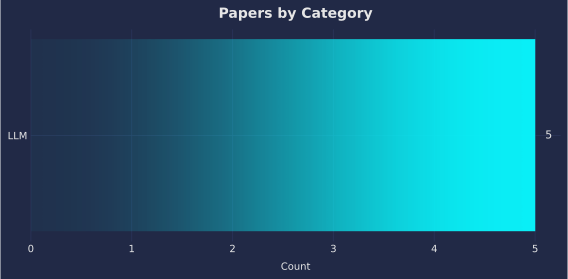
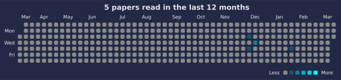

# 📚 Paper Reading Log

Track and visualize your paper reading with auto-updated charts.

<!--CHART_START-->





**Breakdown**

| Category | Count |
|---|---|
| LLM | 52 |
| Multimodal (T/S) | 41 |
| TTS | 25 |
| NAC | 15 |
| Speech | 9 |
| ML | 8 |
| ASR | 7 |
| Dataset (Speech) | 6 |
| Multimodal (T/I) | 6 |
| Multimodal (T/S/I/V) | 4 |
| Image | 2 |
| Multimodal (T/S/I) | 2 |
| ST | 2 |
| VC | 2 |
| Audio | 1 |
| Dataset (Audio) | 1 |
| Multimodal Generation | 1 |
| NV | 1 |
| Text Embedding | 1 |
| THG | 1 |
| TTI | 1 |
| **Total** | **188** |

**Recently read**

- [Does Reinforcement Learning Really Incentivize Reasoning Capacity in LLMs Beyond the Base Model?](https://openreview.net/pdf?id=4OsgYD7em5) — *LLM* (2025-11-30)
- [Artificial Hivemind: The Open-Ended Homogeneity of Language Models (and Beyond)](https://openreview.net/pdf?id=saDOrrnNTz) — *LLM* (2025-11-29)
- [Why Diffusion Models Don’t Memorize: The Role of Implicit Dynamical Regularization in Training](https://openreview.net/pdf?id=BSZqpqgqM0) — *ML* (2025-11-28)
- [Infini-gram mini: Exact n-gram Search at the Internet Scale with FM-Index](https://aclanthology.org/2025.emnlp-main.1268.pdf) — *LLM* (2025-11-27)
- [Auden-Voice: General-Purpose Voice Encoder for Speech and Language Understanding](https://arxiv.org/abs/2511.15145) — *Speech* (2025-11-26)
- [SUNAC: Source-aware Unified Neural Audio Codec](https://arxiv.org/abs/2511.16126) — *NAC* (2025-11-25)
- [Adversarial Poetry as a Universal Single-Turn Jailbreak Mechanism in Large Language Models](https://arxiv.org/abs/2511.15304) — *LLM* (2025-11-24)
- [SAM 3D: 3Dfy Anything in Images](https://ai.meta.com/research/publications/sam-3d-3dfy-anything-in-images/) — *Image* (2025-11-21)
- [CASTELLA: Long Audio Dataset with Captions and Temporal Boundaries](https://arxiv.org/abs/2511.15131) — *Dataset (Audio)* (2025-11-20)
- [ParaS2S: Benchmarking and Aligning Spoken Language Models for Paralinguistic-aware Speech-to-Speech Interaction](https://arxiv.org/abs/2511.08723) — *Multimodal (T/S)* (2025-11-18)
<!--CHART_END-->

## How to add a new paper

Add paper info to `data/papers.yml` in the following format:

```yaml
- title: "Your paper title"
  category: "LLM"
  date: "YYYY-MM-DD"
  link: "https://..."
```

## Reuse This Repo

- Use as template: Click "Use this template" on GitHub, then edit `data/papers.yml`.
- Timezone: Set `PAPERS_TZ` in the workflow (default `Asia/Tokyo`).
- CI validation: The workflow validates `data/papers.yml` before building charts.
- Export: CI also writes a machine-readable `data/papers.json` for reuse.

See `TEMPLATE.md` for details.

## Development

With `uv` (recommended):

```
uv sync
uv run scripts/validate_papers.py
uv run scripts/build_readme.py
uv run scripts/export_json.py
```

## License

- Code: MIT (`LICENSE`)
- Content (notes, `data/papers.yml`, generated charts in `assets/`): CC BY 4.0 — https://creativecommons.org/licenses/by/4.0/
